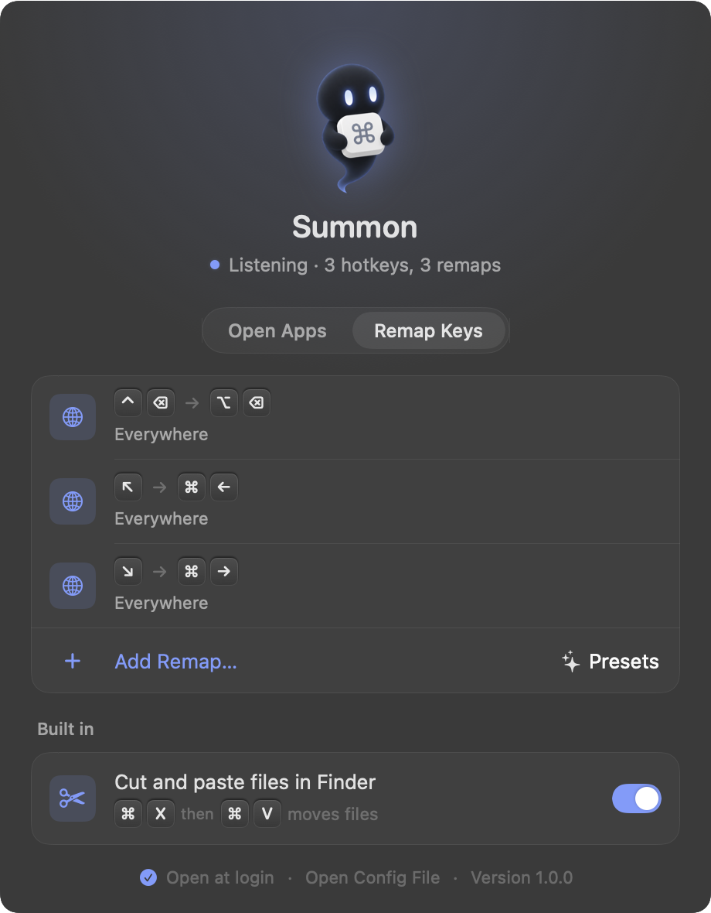
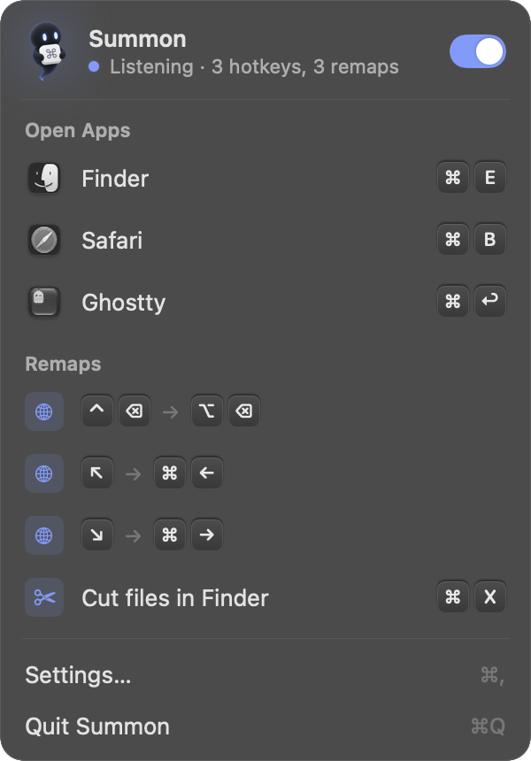

<p align="center">
  
</p>

<h1 align="center">Summon</h1>

<p align="center">Global hotkeys and key remapping for macOS, right in your menu bar.</p>

<p align="center">
  
  &nbsp;
  
</p>

## Install

```sh
brew install --cask matheusmedrado/tap/summon
```

Or grab the DMG from [Releases](https://github.com/matheusmedrado/summon/releases/latest). Summon isn't notarized, so if macOS refuses to open it:

```sh
xattr -dr com.apple.quarantine /Applications/Summon.app
```

On first launch, macOS asks you to give Summon Accessibility access in System Settings > Privacy & Security > Accessibility. It starts listening the moment you turn it on.

## What it does

- **Open apps**: press a combo and the app comes forward, launching it if needed. Press it again while the app is in front and you get a new window.
- **Remap keys**: press one combo, send another. Limit a remap to one app, leave text fields alone while you type, or send a sequence like ⌘A then ⌘C.
- **Presets**: Home and End that jump to the start and end of a line, and ⌃⌫ that deletes a word, for anyone coming from Linux or Windows.
- **Cut and paste files in Finder**: ⌘X then ⌘V moves files, the way file managers do everywhere else.
- **Menu bar panel**: every hotkey and remap at a glance, apps a click away, and one switch to pause it all.

Summon catches keys before the app in front sees them, so it can take over combos apps already use, like ⌘E or ⌘↩.

## Config

Everything lives in `~/.config/summon/config.json`. The settings window edits the same file, and Summon reloads it as soon as you save, so editing by hand works too:

```json
{
  "bindings": [
    { "keys": "cmd+e",      "app": "Finder" },
    { "keys": "cmd+return", "app": "Ghostty" }
  ],
  "remaps": [
    { "keys": "ctrl+delete", "send": "opt+delete" },
    { "keys": "cmd+shift+k", "send": "cmd+a cmd+c", "app": "Safari", "notWhileTyping": true }
  ],
  "finderCut": true
}
```

- **Modifiers**: `cmd`, `opt`, `ctrl`, `shift`.
- **Keys**: letters, digits, `return`, `space`, `tab`, `escape`, `delete`, `forwarddelete`, `left`, `right`, `up`, `down`, `home`, `end`, `pageup`, `pagedown`, `f1` to `f20`, and `minus`, `equal`, `comma`, `period`, `slash`, `semicolon`, `quote`, `backslash`, `grave`, `leftbracket`, `rightbracket`. Keys are matched by their position on a US layout.
- **Apps**: a name (`Safari`), a bundle ID (`com.apple.Safari`) or a path.
- **Sequences**: separate combos with spaces in `send`.
- **Options**: `"newWindow": false` on a binding only brings the app forward. A remap without `app` works everywhere; one with `app` wins inside that app.

## How it works

Summon listens with a keyboard event tap, which is why it needs Accessibility access. A matching combo is swallowed whole, key down to key up, so the app in front never sees any of it. Summon starts at login through launchd, restarts itself if it ever crashes, and opts out of App Nap so hotkeys answer instantly even after hours idle. Logs go to `~/Library/Logs/Summon.log`.

Requires macOS 14 or later.

## Build

```sh
./build.sh install
```

macOS ties the Accessibility permission to the app's signature, so an ad-hoc build needs granting again after every rebuild. To keep it, create a self-signed certificate named `Summon Local Signing` (Keychain Access > Certificate Assistant > Create a Certificate, type Code Signing) and `build.sh` will sign with it. The first build asks to let `codesign` use the certificate's key: choose Always Allow. The app is built for both Apple silicon and Intel and each is signed separately, so plain Allow asks twice, on every build.

## Contributing

Issues and pull requests are welcome.

1. Fork the repo and create a branch.
2. Build and try your change with `./build.sh install`.
3. Make sure `/Applications/Summon.app/Contents/MacOS/Summon --selftest` passes.
4. Open a pull request with a short description of what changed and why.

Every pull request is reviewed before it's merged. Small, focused changes are easiest to review.
